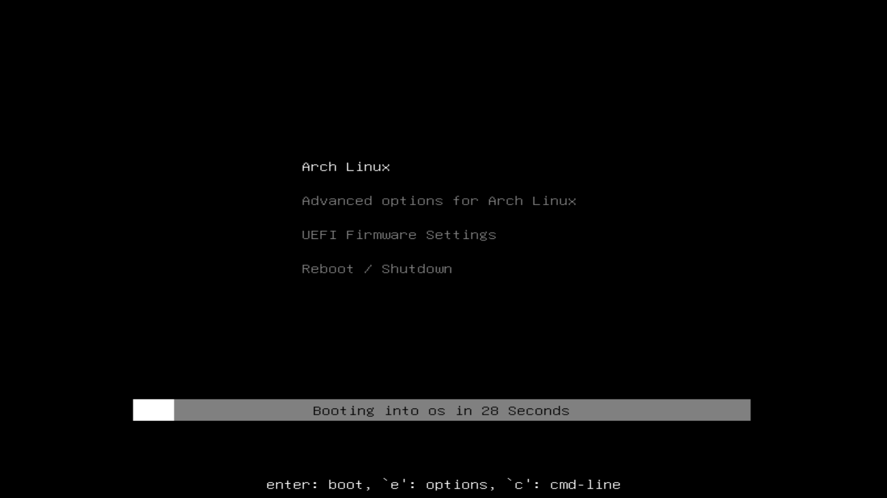

# Simple GRUB theme

Because I wanted to learn how to create a theme, and the default one is not minimal enough imo.

## Installation
(like any GRUB theme)
1. clone project
2. copy to `/boot/grub/themes/`
3. set `GRUB_THEME` variable in `/etc/default/grub` to `/boot/grub/themes/minimal-grub-theme/theme.txt`
4. Create new GRUB config: `sudo grub-mkconfig -o /boot/grub/grub.cfg`

